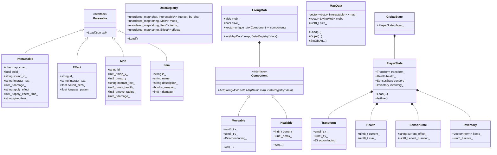
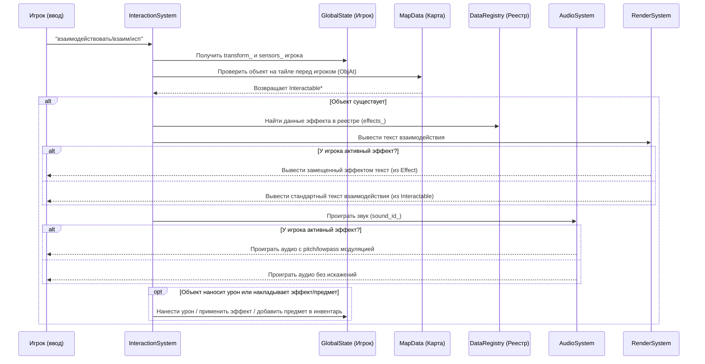
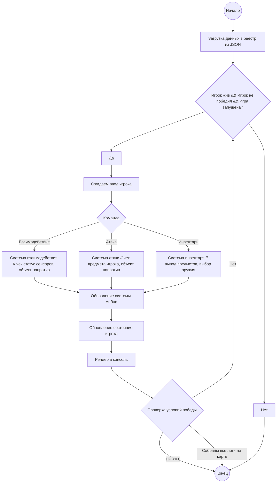

Текстовый RPG, Data-Driven, на принципе ООП + гибридного ECS.
Данные хранятся в JSON файлах, для загрузки используется nlohmann/json.
Для звуков используется OpenAL. Рендер - вывод консоли (stdout)

## World State
Мир состоит из нескольких частей: карты (Map), реестра data-driven объектов (Registry), состояния игрока (GlobalState), менеджера сущностей (MobSystem).

Карта - фиксированная сетка с фиксированными препятствиями по миру. Двумерный массив типов тайлов, которые задаются в файлах.
Задается через файлы содержащие карту вида сверху в 2D с символами, а также через файл с определениями тайлов по символам.

## Данные в компонентах
Все данные хранятся в JSON реестрах - массивах из объектов. 

Примеры структур для компонентов:
*Interactable*
* string: Символ на карте
- string: ID звука взаимодействия
- string: Текст стандартного взаимодействия
- int: Урон, наносящийся при взаимодействия
- string: ID эффекта накладывающегося на игрока

*Effect*
- string: ID эффекта
- string: Замещающий текст взаимодействия, либо пустая строка
- float: Новый питч звуков взаимодействий или -1
- float: Параметр для lowpass фильтра или -1

*Mob*
* string: Символ на карте
* string: Текст взаимодействия
* int: Здоровье
* int: радиус перемещения
* int: Наносимый урон (варьируется в игре на 15% в обе стороны)

*Item*
- string: ID предмета
- string: Название предмета
- string: Описание предмета
- bool: Флаг, является ли предмет оружием
- int: Урон, наносимый если экипировать предмет

## Системы

#### InteractionSystem
Обрабатывает взаимодействия с объектами:
1. Проверяет наличие объекта напротив игрока через Transform
2. Считывает Interactable с объекта -> затем из реестра берет данные
3. Согласно состоянию сенсоров проигрывает звук.
4. Выводит корректный текст, либо замещенный, в зависимости от сенсора 

#### MobSystem
Обрабатывает перемещение и логику мобов
1. Для каждой сущности с компонентом Mob выполняет это
2. Выбирает случайную проходимую соседнюю клетку в заданном радиусе от точки спавна
3. Если эта клетка занята игроком, игроку наносится урон
4. Перемещает сущность

#### AudioSystem
Отвечает за вывод звука
1. По полученному id звука ищет его в реестре
2. В зависимости от состояния сенсора выводит либо модулированный (lowpass+pitch), либо изначальный звук

#### RenderSystem
Отвечает за отображение игры в консоли
1. Выводит полученный текст со взаимодействий и команд

## Диаграмы

#### Классовая диаграмма
Показывает актуальную структуру сущностей, компонентов и реестра данных:

#### Последовательность (взаимодействия)
Процесс обработки взаимодействия игрока с объектом на карте:

#### Игровой цикл

